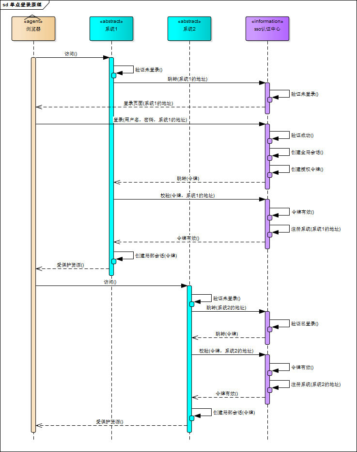
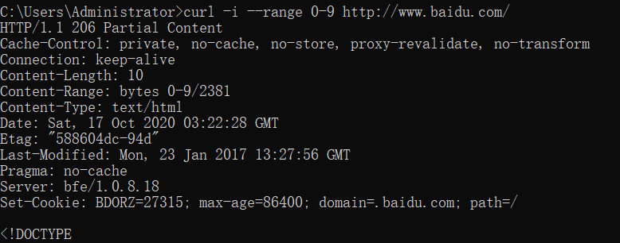

# HTTP

## Cookie跨域共享
  假设有两个域名。a.b.e.f.com.cn,c.d.e.f.com.cn。根据域名分级，域名1和2都是e.f.com.cn的子域名，又是com.cn的子域名。服务端可以分别获得当前域名和父域名下的cookie，但如果当前网站，修改了父域名的cookie，那么会覆盖，也就是说，一个域名只能获得一个cookie。浏览器发送http请求时会自动携带与该域匹配的cookie，而不是所有cookie。
### 单点登录
  SSO，在多个应用系统中，用户只需要登录一次就可以访问所有相互信任的应用系统。
  + 如果在同一个上层域名下，把token或者sessionID存在顶级域名下的cookie中，那么所有在顶级域名下的服务，都会共享cookie。贡献cookie的同时也意味着必须要共享session，不然无法识别SessionID，这对跨服务器，跨语言的服务不友好。另外cookie存在安全问题。
  + 如果不在同一个域名下，我们需要一个独立的SSO认证中心。
  
  

## 断点续传
  + 断点续传指的是，在上传或下载时，将任务人为的划分为几个部分，每一个部分采用一个线程上传或者下载，如果碰到网络故障，可以从已经上传或下载的部分开始继续，而没有必要从头开始上传或者下载。可以节省时间，提高速度。
  + HTTP1.1开始支持获取文件的部分内容，这为并行下载以及断点续传提供了技术支持，在Header里的Range和Content-Range实现。
  ``Range:(unit=first byte pos)-[last byte pos]``
  发出请求报文后，服务器会在Content-Range头部返回当前接受的范围和文件总大小``Content-Range: bytes (unit first byte pos) - [last byte pos]/[entity legth]``
  + 断点续传可能出现服务器当前文件与客户端已传部分的文件不一致，需要增强校验。
    1. Last-Modified
      If-Modified-Since和Last-Modified一样都是用于记录页面最后修改时间的HTTP头信息，Last-Modified是由服务器往客户端发送的HTTP头，IF-Modified-Since是客户端发往服务端的头，当客户端请求本地存在的cache页面时，客户端会通过If-Modified-Since将Last-Modified发送过来的最后修改时间戳发送回去，让服务端进行验证，通过时间戳判断文件是否是最新的。如果不是，返回最新的内容，如果是，则返回304告诉本地客户端。
    2. Etag
     + 一些文件可能会周期性的更改，但不改变内容，这时候我们不希望重新GET
     + If-Modified-Since的时间粒度是秒，某些情况下不够精细。
     + 某些服务器不能精确得到文件最后修改时间。
     + Etag仅仅是一个文件标记，也可以是一个版本标记。
    3. If-Range
      用于判断实体是否发生该表，如果实体未改变，服务器发送客户端丢失的部分，否则发送整个实体。If-Range必须和Range配套使用，如果请求报文中没有Range，将会被忽略，如果和服务器文件一致，返回206。
      ``If-Range: Etag | HTTP-Date``
      > If-Range: “627-4d648041f6b80”   
      >If-Range: Fri, 22 Feb 2013 03:45:02 GMT

  + 工作原理:
    1. 第一次请求：客户端发起一个请求HTTP GET一个文件，服务器处理请求，返回文件内容以及相应的Header，其中包括Etag或者Last-Modified，状态码返回200
    2. 第二次请求，开启断点重传：客户端发起一请求HTTP GET一个文件，同时发送If-Range，包含Etag|HTTP-Date，同时指定Range字段，传送文件块。服务端判断Etag是否相同，如果相同返回206，否则状态码200。
    

## 实际问题
1. 购物车信息存储在session？cookie？还是数据库？
我们使用购物车的存储方式主要有：Session,cookie,数据库。
   + Session
   + 优点：购物车信息保存在服务端，可以保存指定大小的信息。
   + 缺点：对于大型网站会占用过多的服务器内存资源，造成服务器压力过大，Session保存的信息会在用户退出后丢失。
   。
   + Session可以钝化和活化，在退出服务器时，将session序列化到磁盘中，再次启动服务器时，反序列化磁盘文件，客户端使用cookie中的sessionID来访问，cookie中的sessionID在服务器退出后不关闭。
   + Cookie
   + 优点：购物车信息存储在客户端，不占用服务器资源。
   + 缺点：Cookie大小有限制，不能超过4k，而且不够安全。但如果是公共办公环境，Cookie保存的信息会被覆盖。并且，需要继续用户数据的广告推荐，由于服务器未存储数据无法实现。
   + 数据库存储
   + 优点：持久化储存，可以分析用户购买行为。
   + 缺点：网站速度变慢，成本和维护增加。
   + ### 具体解决方案迭代
    1. 对于登录用户，根据UserID查询购物车信息，对于非登录用户，根据浏览器选择查询方式，（如果火狐浏览器，根据sessionid查询，如果是IE或者是360，根据IP查询）。大概适用于一天订单只有几万单的时候，当订单超过10万单，购物车数据库写压力特别大。查询也时常超时。因此需要清理超过10天的数据，新建一个job每天夜里删除超过10天的数据。
    2. 订单量继续增加，数据库写压力很大，因此考虑分库解决写压力。根据登录用户和匿名用户拆库，对于登录用户，将登录用户按照奇偶拆分，对于匿名用户，根据浏览器来源，使用session或者ip，对于表结构，使用UserID和CreatedDateTicks时间戳做联合主键，将购物车信息存储在content中，序列化未XML。上一个版本中数据库会有大量的更新操作，这会锁表，效率很低，现在只需要进行插入，无需更新。查询数据时，返回最后一条即可。
    3. 字节跳动的解决方案：缓存+Session持久化
2.
