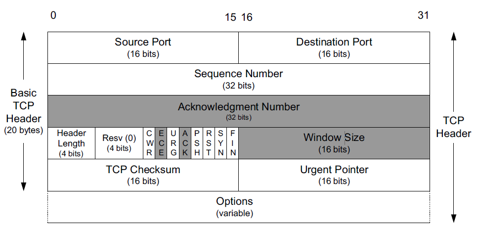

# TCP
+ TCP提供了一种面向连接的、可靠的字节流服务。面向连接的是指使用TCP的两个应用程序必须在他们可交换数据之前，通过相互联系来建立一个TCP链接。TCP中没有广播和组播的概念。
+ TCP提供一种字节流抽象概念给应用程序，没有由TCP自动插入的记录标志和消息边界。每个端点独立选择自己的读写大小。
+ TCP不会解读字节流里的字节内容，它不知道正在交换的数据字节是不是二进制数据、ASCII字符、EBCDIC字符或其他东西，对字节流的解读取决于连接中的每个端点的应用程序。

## TCP的可靠性
+ TCP必须把一个发送应用程序的字节流转换成一组IP可以携带的分组。这被称为组包，这些分组包含序列号，该序列号在TCP中实际代表了每个分组的第一个字节在整个数据流中的字节偏移，而不是分组号。这允许分组在传送中时大小可变的，并允许它们重新组合，称为重新组包。应用程序数据被打散成TCP认为的最佳大小的块来发送，一般使得每个报文段按照不会被分片的单个IP层数据报的大小划分，这与UDP不同，应用程序每次写入通常就产生一个UDP数据，其大小就是写入的那么大。由TCP传给IP的块称为报文段 segment。
+ TCP维持了一个强制的校验和，该校验和设计它的头部、任何相关的应用程序数据和IP头部的所有字段。这是一个端到端的伪头部，它用于检测传送中引入的比特差错，如果一个带无效校验和的报文段到达，那么TCP会丢弃它，不为被丢弃的分组发送任何确认。TCP校验和使用的数学函数与其他互联网协议一样，对于大数据的传送，这个校验和是否不够强壮是值得担心的，所以应用程序应该应用自己的差错保护方法（更强的校验和或CRC）,或者使用一种中间层来达到同样的效果。
+ 当TCP发送一组报文段时，它通常设置一个重传计时器，等待对方的确认接收。TCP不会为每个报文段设置一个不同的重传计时器。相反，发送一个窗口的数据，它只设置一个计时器，当ACK到达时再更新超时，如果有一个确认没有及时的接受到，这个报文段就会被重传。
+ 当TCP接收到连接的另一端的数据时，它会发送一个确认，这个确认可能不会立即发送，而一般会延迟片刻。TCP使用的ACK是累积的，从某种意义上讲，一个指示字节号N的ACK暗示着所有直到N的字节，但不包含N，已经成功的接收了，这对于ACK丢失来说带来了一定的鲁棒性——如果一个ACK丢失，很有可能后续的ACK就足以确认前面的报文段了。
+ TCP给应用程序提供一种双工服务，这就是说数据可向两个方向流动，两个方向互相独立。因此，连接的每个端点必须对每个方向维持数据流的一个序列号。一旦建立了一个连接，这个连接的一个方向上的包含数据流的每个TCP报文段也包含了相反方向上的报文段的一个ACK。每个报文段也包含了一个窗口通告以实现相反方向上的流量控制。为此，再一个连接中，当一个TCP报文段到达时，窗口可能向前滑动，窗口大小可能改变，同时新数据可能已到达。一个完整的TCP连接时双向和对称的，数据可以在两个方向上平等的流动。
+ 使用序列号，一个TCP接收端可丢弃重复的报文段和记录以杂乱次序到达的报文段，因为TCP是一个字节流协议，TCP绝对不会以杂乱的次序给接收应用程序发送数据。因此TCP接收端可能会被迫先保持大序列号的数据不交给应用程序，直到缺失的小序列号的报文段被填满。

## TCP的头部和封装
+ TCP头部紧跟着IP头部或IPv6扩展头部，经常是20字节长（不带TCP选项），带选项，TCP头部可达60字节。常见选项包括最大段大小、时间戳、窗口缩放和选择性ACK。

+ 每个TCP头部包含了源和目的端口号，这两个值与IP头部中的源和目的IP地址一起，唯一地标识了每个连接。在TCP术语中，一个IP地址和一个端口的组合又是被称作一个端点或套接字。每个TCP连接由一对套接字或端点(四元组，由客户机IP地址，客户机端口号，服务器IP地址以及服务器端口号组成)唯一标识。
+ 序列号字段标识了TCP发送端到TCP接收端的数据流的一个字节，该字节代表着包含该序列号的报文段的数据中的第一个字节。如果我们考虑在两个应用程序之间的一个方向上流动的数据流，TCP给每个字节赋予一个序列号。这个序列号是一个32位无符号数，到达$2^32-1$后再循环回到0.因为每个被交换的字节都已编号，确认号字段 ACK包含的值是该确认号的发送方期待接收的下一个序列号。即最后被成功接收的数据字节的序列号+1.这个字段只有在ACK位被启用的情况下才有效，这个ACK位字段通常由于除了初始和末尾报文段之外的所有报文段。发送一个ACK与发送任何一个TCP报文段的开销是一样的，因为那个32位的ACK号字段一直都是头部的一部分，ACK位字段也一样。
+ 当建立一个新连接时，从客户机发送至服务器的第一个报文段的SYN位字段被启用。这样的报文段称为SYN报文段，或简单的称为SYN。然后序列号字段包含了在本次连接的这个方向上要使用的第一个序列号，后续序列号和返回的ACK号也在``这个方向上(?)。``注意这个数字不是0和1，而是另一个数字，经常是随机选择的，称为初始序列号 ISN，ISN不是0和1，这是一种安全措施。发送在本次连接的这个方向上的数据的第一个字节的序列号是ISN加1，因为SYN位字段会消耗一个序列号，消耗一个序列号意味着使用重传进行可靠传输。
+ TCP可以被描述为一种带累积正向确认的滑动窗口协议。ACK号字段被构建用于指明在接收方已经顺序收到的最大字节加一。如果字节1-1024已经接收成功，而下一个报文段包含字节2049-3072，那么接收方不能使用规则的ACK号字段去发信告诉发送方它接收到了这个新报文段。然而，现代TCP有一个选择确认选项，可以允许接收方告诉发送方它正确地收到了次序杂乱的数据。当与一个具有选择重发能力的TCP发送方搭配时,就可以实现一个具有选择重发能力的TCP发送方搭配时，就可以实现性能的显著改善。
+ 头部长度字段给出了头部的长度，以4字节为单位，它是必须的，因为选项字段长度可变。作为一个4位的字段，TCP被限制为只能带60字节的头部。而不带选项，为20字节。
+ TCP8位标志：
  1. CWR 拥塞窗口减
  2. ECE ECN回显，发送方接收到了一个更早的拥塞通告
  3. URG 紧急，使紧急指针字段有效
  4. ACK 确认，确认号字段有效
  5. PSH 推送，没被可靠地实现或用到
  6. RST 重置连接
  7. SYN 用于初始化一个连接地同步序列号
  8. FIN 该报文段的发送方已经结束向对方发送数据
+ TCP的流量控制由每个端点使用窗口大小字段来通告一个窗口大小来完成。这个窗口大小是字节数，从ACK号指定的，也是接收方想要接收的那个字节开始。这是一个16位的字段，限制了窗口大小到65535字节。从而限制了TCP的吞吐量性能。
+ TCP校验和字段覆盖了TCP的头部和数据以及头部中的一些字段，使用一个伪头部进行计算。这个字段是强制的，由发送方进行计算和保存，然后由接收方验证。
- [ ] 紧急指针字段只有在URG位字段被设置时才有效。这个指针是一个必须要加到报文段的序列号字段的正偏移，以产生紧急数据的最后一个字节的序列号。TCP的紧急机制是一种让发送方给另一端提供特殊标志数据的方法。
+ 最常见的选项字段是最大段大小选项，称为MSS，连接的每个端点一般在它发送的第一个报文段（SYN被设置的报文段）上指定这个选项。MSS指定该选项的发送者在相反方向上希望接收到的报文段的最大值。
+ 当一个连接在被建立和终止时，交换的报文段只包含TCP头部而没有数据（带或不带选项），如果这个方向上没有数据传输，那么一个不带任何数据的头部也会被用于确认接收到的数据（称为一个pure ACK），同时通知通信放改变窗口大小（称为窗口更新 window update）。当一个报文段可不带数据发送时，超时操作会因此而产生一些新情况。

## TCP连接管理
+ 一个TCP连接由一个4元组构成，或者说是由一对端点或套接字构成。一个TCP连接通常分为3个阶段：启动、数据传输和退出。
+ 启动主要步骤：
  1. 主动开启者(客户端)发送一个SYN报文段(即一个在TCP头部的SYN位字段置位的TCP/IP数据包)，并指明自己想要连接的端口号和它的客户端初始序列号ISN(c)，通常客户端还会借此发送一个或多个选项。客户端发送的这个SYN报文段称作段1.
  2. 服务器也发送自己的SYN报文段作为响应，并包含了它的初始序列号ISN(s)，该段称作段2.此外，为了确认客户端的SYN，服务器将其包含的ISN(c)数值加1后作为返回的ACK数值。因此，每发送一个SYN，序列号就会自动加1。这样如果出现丢失的情况，该SYN段将重传。
  3. 为了确认服务器的SYN，客户端将ISN(s)的数值加1后作为返回的ACK数值。这称作段3。 
+ TCP三次握手的目的不仅在于让通信双方了解一个连接正在建立，还在于利用数据包的选项来承载特殊的信息，交换初始序列号ISN。
+ 退出主要步骤：
  1. 连接的主动关闭者发送一个FIN段指明接收者希望看到的自己当前的序列号（K），FIN段还包含了一个ACK段用于确认对方最近一次发来的数据(标记为L)。
  2. 连接的被动关闭者将K的数值加1作为响应的ACK值，以表明它已经成功接收到主动关闭者发送FIN。此时，上层的应用程序会被告知连接的另一端已经提出了关闭的请求。通常，这将导致应用程序发起自己的关闭操作。接着，被动关闭者将身份转变为主动关闭者，并发送自己的FIn，该报文段的序列号为L。
  3. 为了完成连接的关闭，最后发送的报文段还包含一个ACK用于确认上一个FIN，值得注意的是，如果出现FIN丢失的情况，那么发送方将重新传输直到接受到一个ACK确认为止。
+ 建立一个TCP连接需要三个报文段，而关闭一个TCP报文段需要4个报文段。TCP协议还支持连接处于半开启状态。存在半开启状态的原因在于TCO通信模型是双向的，这意味着在两个方向中可能会出现只有一个方向正在进行数据传输的情况。TCP的半关闭操作是指仅关闭数据流的一个传输方向，而两个半关闭操作合在一起就能关闭整个连接。因此TCP协议规定通信的任何一方在完成数据发送任务后都能发送一个FIN。当通信的另一方接收到这个FIN时，就会告知应用程序对方已经终止了对应方向的数据传输。由此可见，当程序发布关闭操作后，通信双方往往通过发送FIN段来关闭双向的数据传输。
+ 7个报文段是每一个TCP连接在正常建立与关闭时的基本开销，因此当只需要交换少量数据时，一些应用程序更愿意选择在发送与接收数据之前不需要建立连接的UDP协议，但同时，这些应用程序也会面对由此引入的错误修复、拥塞管理以及流量控制等诸多问题。

## TCP半关闭
+ 套接字API提供了半关闭操作，应用程序只需要调用shutdown()函数来代替基本的close()函数，就能送一个FIN给对方，但仍然希望接收来自对方的数据直到对方发送一个FIN。但绝大多数程序依然会调用close()函数来关闭一条连接的两个传输方向。
+ 首先发送的两个报文段与TCP正常关闭完全相同：初始者发送的FIN，接着时接收者回应该FIN的ACK。在ACK后可以传输任意数量的数据段。当接收半关闭的一方完成数据发送后，他会发送一个FIN来关闭本方的连接，同时向发起半关闭的应用程序发出一个文件尾指示。当第2个FIN被确认后，整个连接完全关闭。

## TCP同时打开与关闭
+ 通信双方在接收到来自对方的SYN之前必须先发送一个SYN;两个SYN必须经过网络送达对方。该场景还要求通信双方都拥有一个IP地址和端口号，并将其告知对方，称其为同时打开。
+ 例如，主机A的一个应用程序通过本地7777端口向主机B的8888端口发送一个主动打开请求，与此同时B的一个应用程序也通过本地8888端口向主机A的7777端口提出一个主动打开请求，此时就会发生一个同时打开的情况。这种情况不同于主机A的一个客户端连接主机B的一个服务器，而同时又有主机B的一个客户端连接主机A的一个服务器，这种情况下，服务器始终是连接的被动打开者而非主动打开者，而各自的客户端也会选择不同的端口号，因此，他们可以被分为两个不同的TCP连接。

+ 一个同时打开过程需要交换4个报文段，比普通的三次握手增加了一个。由于通信双方都扮演了客户端与服务器的角色，因此不能将任何一方称作客户端或者服务器，同时关闭并没有太大区别。通信一方提出主动关闭请求，并发送首个FIN，在同时关闭中，通信双方都会完成上述工作。同时关闭需要交换与正常关闭相同数量的报文段，两者真正的区别在于报文段序列是交叉的还是顺序的

### TCP有一个四元组被唯一标识，且用于区分TCP报文段只有这个四元组和一个序列号，这导致，如果序列号被伪造或重复选取对连接的影响是致命的，因此引入初始序列号，随时间而改变，确保每一个连接都拥有不同的序列号。linux系统采用一个相对复杂的过程来选择它的初始序列号，采用基于时钟的方案，并且针对每一个连接为时钟设置随机的偏移量。随机偏移量在连接标识(4元组)的基础上利用加密散列函数得到，散列函数的输入每隔5分钟就会改变。Windows类似。
